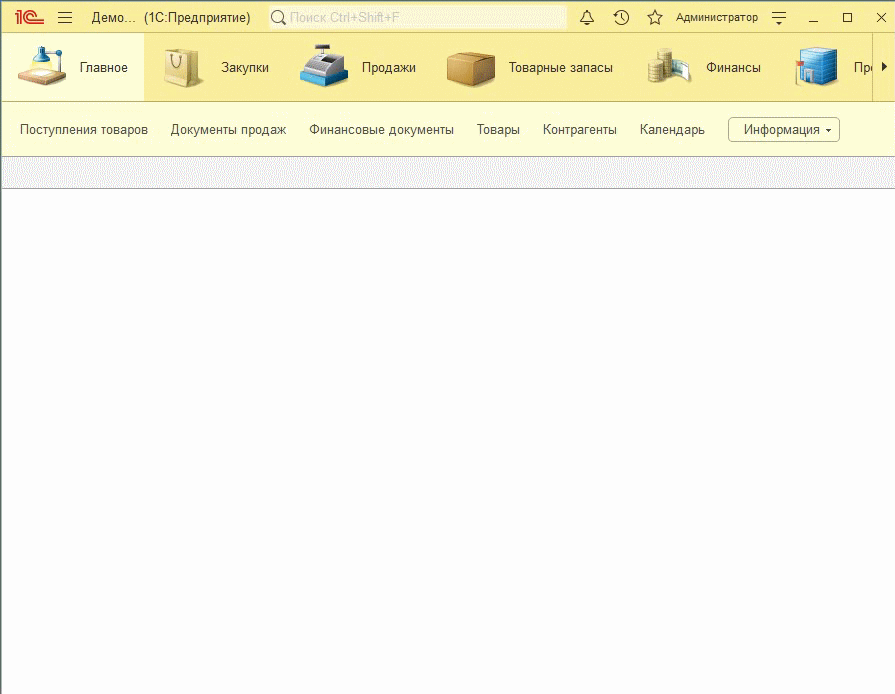
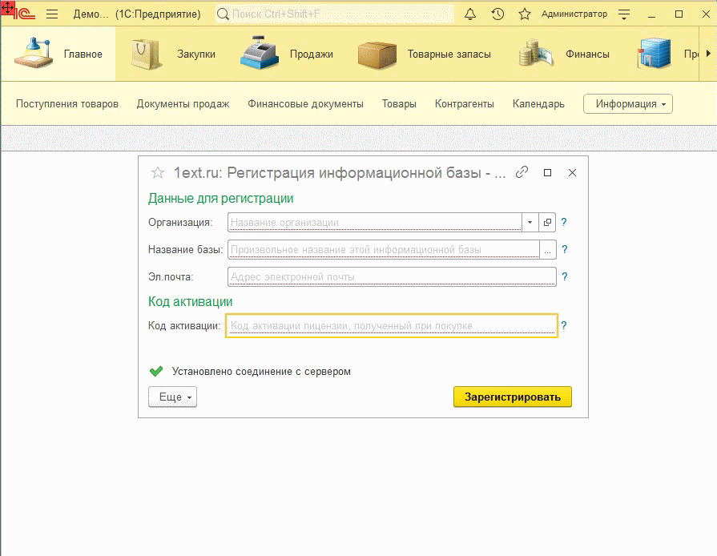
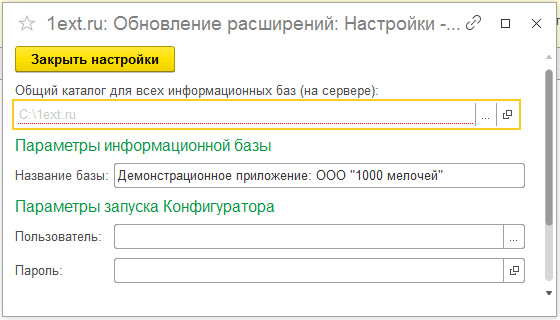

## Установка в информационную базу

- Скачайте обработку для установки [setup.epf](https://github.com/1ext-ru/setup/raw/main/setup.epf).
- Запустите информационную базу в монопольном режиме под пользователем с правами Администратора.
- Запустите скачанную обработку setup.epf в режиме Предприятия через меню "Файл" - "Открыть". 
- Нажимайте на кнопку Далее для продолжения установки.
- После завершения установки перезапустите программу.

## Регистрация базы и активация лицензии

После первого запуска программы откроется окно регистрации информационной базы. Заполните реквизиты:

- **Организация**  - выберите или введите вручную название Организации.
- **Название базы** - заполните по кнопке или введите вручную произвольное название для этой информационной базы.
- **Эл.почта** - укажите свой адрес эл.почты, на который будет отправлен запрос для подтверждения регистрации. На один адрес можно регистрировать несколько информационных баз.
- **Код активации** - введите код активации [лицензии](3.%20%D0%9B%D0%B8%D1%86%D0%B5%D0%BD%D0%B7%D0%B8%D1%8F.md), полученный при покупке.

## Настройка параметров

После успешной регистрации откроется окно с настройками фреймворка. Заполните реквизиты:

- **Общий каталог для всех информационных баз (на сервере)**  - в этом каталоге при обновлении расширений будут создаваться временные файлы. На выбранном диске должно быть достаточное количество свободного места. Для расчета можно ориентироваться на то, что, к примеру, одна только выгрузка в файлы конфигурации <Бухгалтерия предприятия ред.3> занимает почти 4 Гб. Каталог рекомендуется размещать в корне диска. Полный путь к каталогу должен быть минимальным. 
- **Параметры запуска Конфигуратора** - Имя пользователя и Пароль для запуска Конфигуратора.

На этом, установка и настройка Фреймворка завершена!
